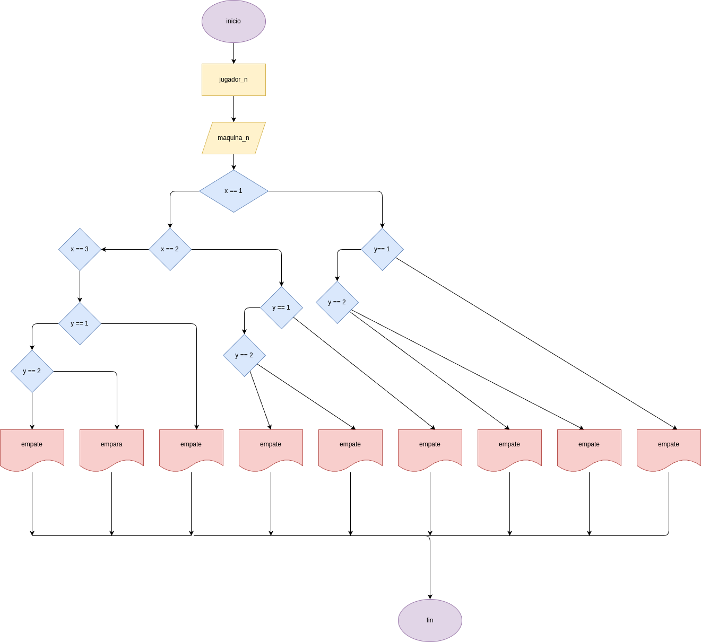

# piedra-papel-o-tijera
jugar piedra papel o tijera con py

## analisis

### variable de entrada
x = 1 = piedra 2 = papel 3 = tijera
### procesamieno

if computer_number == 1:
    computer_choice = "piedra"
elif computer_number == 2:          
    computer_choice = "papel"
else:
    computer_choice = "tijera"  

## diseño

